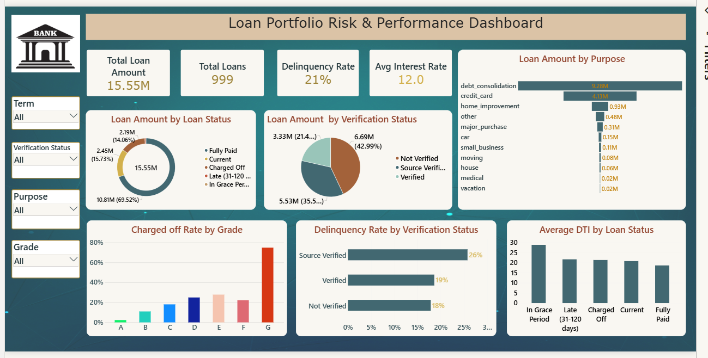

# Loan Portfolio Risk & Performance Dashboard

An interactive dashboard for monitoring the risk and performance of a bank's loan portfolio — built to help credit and risk teams track delinquency, charge-off behavior, and portfolio composition at a glance.



## Overview

This report consolidates loan-level data into a single view so stakeholders can quickly answer:
- How large is the portfolio, and how is it performing overall?
- Which loan segments carry the most risk (by grade, purpose, or verification status)?
- How does borrower verification status relate to delinquency?
- How does debt-to-income (DTI) vary across loan outcomes?

## Key Metrics (KPI Cards)

| Metric | Value |
|---|---|
| Total Loan Amount | 15.55M |
| Total Loans | 999 |
| Delinquency Rate | 21% |
| Avg Interest Rate | 12.0% |

## Filters / Slicers

The dashboard supports interactive filtering by:
- **Term**
- **Verification Status**
- **Purpose**
- **Grade**

## Visualizations

1. **Loan Amount by Loan Status** (donut chart) — breakdown of portfolio value across Fully Paid, Current, Charged Off, Late (31–120 days), and In Grace Period statuses.
2. **Loan Amount by Verification Status** (pie chart) — split of loan value across Not Verified, Source Verified, and Verified borrowers.
3. **Loan Amount by Purpose** (bar chart) — loan value ranked by purpose (debt consolidation, credit card, home improvement, other, major purchase, car, small business, moving, house, medical, vacation).
4. **Charged Off Rate by Grade** (bar chart) — charge-off rate increasing across loan grades A through G, highlighting risk concentration in lower grades.
5. **Delinquency Rate by Verification Status** (bar chart) — compares delinquency rates across Source Verified, Verified, and Not Verified segments.
6. **Average DTI by Loan Status** (bar chart) — average debt-to-income ratio across loan statuses (In Grace Period, Late, Charged Off, Current, Fully Paid).

## Key Insights

- Grade **G** loans show a sharply elevated charge-off rate compared to Grade A–F, confirming grade as a strong risk indicator.
- **Source Verified** loans have the highest delinquency rate (26%) among verification segments, despite verification typically being associated with lower risk.
- **Debt consolidation** and **credit card** purposes account for the majority of total loan value.
- Loans **In Grace Period** and **Late** status carry higher average DTI than **Fully Paid** loans, suggesting DTI as a leading risk signal.

## Data Fields Used (inferred)

- Loan amount, loan status, term, grade
- Verification status, loan purpose
- Interest rate, DTI (debt-to-income ratio)
- Delinquency / charge-off indicators

## Tech Stack

- **Tool:** Power BI 
- **Data:** Loan-level portfolio dataset (e.g., Lending Club–style loan data)

## How to Use

1. Open the report file in Power BI Desktop (or the relevant BI tool).
2. Use the slicers on the left (Term, Verification Status, Purpose, Grade) to filter the entire dashboard.
3. Hover over chart elements for detailed tooltips.
4. KPI cards update dynamically based on selected filters.

## File Structure

```
├── README.md
├── loan_portfolio_dashboard.pbix   # main dashboard file
├── data/Lending club data original data set.csv  # source data 
└── loan_portfolio_dashboard.png     # dashboard screenshot
```

---
*Update the Tech Stack, File Structure, and Data Fields sections above to match your actual project setup.*
